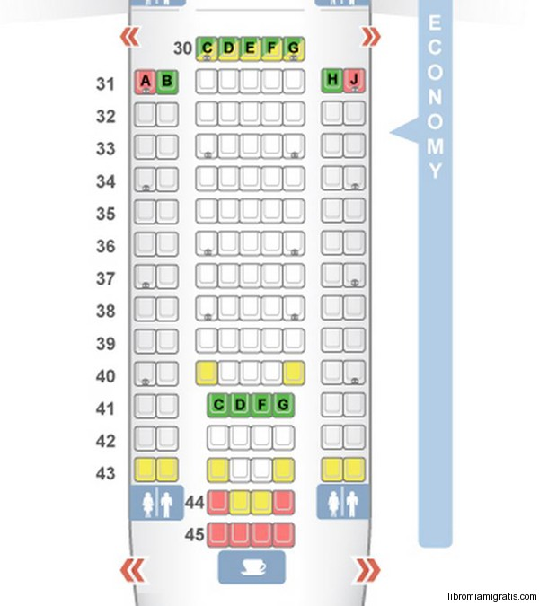

# Objetivo general #
Con base a la imagen anexa, diseñe una pagina web que permita reservar un vuelo, tomando en consideración los datos solicitados por las aerolíneas, si lleva equipaje de mano y/o de Bodega y la asignación de su asiento. Para todos los servicios hay un costo, de igual manera la del vuelo. La pagina debe mostrar los asientos disponibles y los no disponibles, una vez es asignado un asiento debe marcarlo con no disponible. Por otro lado debe haber una boton que me permita ver al pulsarlo, los pasageros registrados y sus asientos asignados.

Cabe destacar que la información no debe registrarse en ningun archivo, una se vez salga de la página se pierde, lo que se desea es simular el registro de pasajeros. Además deben tomar en cuenta que puede haber cancelación de vuelo y debe colocar el asiento disponible.

La imagen es referencial por lo que el diseño de la presentación de la información lo dejo a su criterio, lo que si deben respetar es las letras de la filas y los numeros de los asientos, Además deben usar transformaciones y transiciones.

## Objetivos de la aplicación ##
- Reservaciones de un vuelo
- Index de las reservaciones
- Creacion de diferentes vuelos con diferentes asientos
- Vista de los asientos disponibles o no disponibles por vuelo
- Creacion de descuentos personalizados para las reservaciones

## Funciones de la aplicación ##
- Añadir, cancelar, modificar una reservación
- Añadir, eliminar, modificar un vuelo
- Añadir, eliminar, modificar un descuento
- Añadir, eliminar, modificar clientes
- Modificación de parametros generales de las reservaciones
- Posibilidad de ver el monto total del costo de las reservaciones desglosado por tarifas
- Posibilidad de reservar para varios pasajeros con varios asientos
- Posibilidad de poder elegir dos vuelos en una reservación

## Cosas a tener en cuenta ##
- Cuando se añade una resevación el asiento seleccionado comienza a estar no disponible
- Cuando se cancela una reservación el asiento comienza a estar disponible y los montos totales se deben actualizar restando el monto de la reservación
- Si se modifica el asiento de una reservación el asiento anterior pasa a estar disponible y el nuevo asiento a estar no disponible
- Datos del cliente:
    * ID
    * Número de pasaporte o cédula si el pasaporte esta vencido
    * Nombres y apellidos
    * Fecha de nacimiento
    * Teléfono
    * Email
    * Nacionalidad
    * Sexo
    * Visa (Si/No)
- Datos de las reservaciones:
    * ID
    * Cliente
    * Cada reservación tendra en cuenta el identicador del vuelo
    * Descuentos, Se pueden escoger varios descuentos por reservación
    * Servicios, Se pueden escoger varios servicios por reservación
    * Servicio medico (Si/No) *
    * Ayuda con el equipaje (Si/No) *
    * Traductor (Si/No) *
    * Wifi (Si/No) *
    * Objeto de valor dentro del equipaje (Si/No) *
- Datos del vuelo:
    * ID
    * Tarifa del vuelo
    * Destino del vuelo
    * Lugar de salida
    * Fecha y hora de salida
    * Tiempo de vuelo
    * Visa (Si/No)
- Datos del descuento:
    * ID
    * Porcentaje
    * Valor
    * Descripcion
    * Rango de edad (inicio-final) *
- Datos del servicio:
    * ID
    * tarifa
    * Descripción

## Validaciones ##
- No pueden haber mas de un vuelo con el mismo ID y el ID es requerido
- No puede haber mas de una reservación con el mismo ID y el ID es requerido
- No puede haber mas de un descuento con el mismo ID y el ID es requerido
- No puede haber mas de un cliente con el mismo ID y el ID es requerido
- No puede haber mas de un servicio con el mismo ID y el ID es requerido
- Se debe validar que el asiento este disponible y el asiento es un input requerido
- Verificar que la maleta de mano no sobrepase el peso maximo establecido en los parametros generales
- La tarifa del vuelo es requerida
- La tarifa del servicio es requerida
- Si el vuelo requiere visa se debe validar que el cliente posea visa
- El origen y el destino de un vuelo no pueden ser el mismo *
- Validar que cuando se guarde el vuelo seleccionado en la simulación de clientes no hayan mas de un checkbox seleccionado
- Validar que un vuelo no posea el caracter **~** en el id *
- Validad que los id no posean espacios *
- Validar que el id del vuelo no posea un numero al inicio *
- Validar que la fecha de nacimiento no sea mayor a la actual *

## Parametros generales ##
- Tarifa sin maleta (general)
- Tarifa con maleta
- Peso de la maleta incluida en la tarifa
- Tarifa maleta de mano
- Peso del bolso o maleta de mano
- Tarifa de maleta extra
- Cantidad de maletas extras posibles
- Tarifa por sobrepeso de la maleta
- Tarifa por mascota
- Tarifa por servicio medico *
- Tarifa por servicio de ayuda con el equipaje *
- Tarifa por servicio de traductores *
- Tarifa por servicio de wifi *
- Tarifa por servicio de abordaje prioritario *
- Tarifa por objetos valiosos dentro del equipaje con porcentajes (Servicio Declaracion Expresa de Valor) *
- Unidad monetaria *

## Simulación para clientes ##
- Escoger vuelo de ida
    * Mostrar info de los vuelos registrados en la simulación general
- Escoger vuelo de vuelta
    * El origen debe ser igual al destino del vuelo de ida
    * Se cambia el boton de Solo vuelo ida a Confirmar
- Salir de vuelos
    * Se vacia el acordion de los vuelos
    * Se muestra el boton VueloVueltaButton
    * Se cambia el boton de Confirmar a Solo vuelo ida
    * Se oculta el div de los vuelos
    * Se muestra el div de los asientos
    * La navbar en asientos se activa
- Escoger los asientos
    * Deben aparecer los asientos ocupados ya por reservaciones registradas
    * Por cada asiento escogido se debe añadir un acordion para llenar los datos del cliente
    * Se debe ir modificando un input de los asientos
- Salir de asientos
    * Se esconde el div de los asientos se muestra el div de los pasajeros
    * La navbar en pasajeros se activa
- Pasajeros
    * Si hay dos vuelos la cantidad de pasajeros es la cantidad de asientos entre 2, si solo hay uno es la cantidad de asientos
    * Generar la lista con los inputs para la cantidad de pasajeros escogida
    * Se deben validar los datos de los clientes
        + Se debe poder seleccionar el area del telefono
        + Validar pasaporte (9 numeros venezuela)
        + Validar cedula (8 numeros venezuela)
        + Validar telefono
- Salir de pasajeros
    * Se esconde el div de pasajeros se muestra el div de reservaciones
    * Se activa la navbar de reservaciones
- Reservacion
    * Se deben dar a escoger todos los datos de la reservación
    * Se deben dar a escoger los servicios personalizados
- Salir de reservacion
    * Se esconde el div de la reservacion se muestra el del pago
    * Se activa la navbar de pagos
- Pago
    * Se debe mostrar un boleto con los datos que se han registrado hasta el momento y el costo de las tarifas
    * Datos de la tarjeta:
        + Nombre del titular
        + Numero de tarjeta (16 digitos)
        + Fecha de expiracion
        + CVV (3 digitos)
    * Datos de facturacion:
        + Correo electronico
        + Direccion de residencia
        + Ciudad
        + Pais
    * Al finalizar se debe mostrar un mensaje con pago finalizado y se deben registrar los datos de los clientes en el general
    * Una vez que el usuario acepte el mensaje se usa la funcion Salir para volver al general
- Regresar *
    * Regresar a vuelos
        + Se oculta el div actual
        + Se muestra el div de los vuelos
        + Se generan los vuelos con la funcion AddVuelo()
        + La navbar en vuelos se activa
        + Se elimina el valor del input de VuelosHidden
        + Se elimina el valor del input de AsientosSeleccionadosSimulacion
        + Se vacia SelectVueloSimulacion
        + Se vacia SelectAsientosSimulacion
        + Se vacia ListaDatosPasajeros
        + Se deshabilitan los acceso a los otros modulos posteriores
    * Regresar a asientos
        + Se oculta el div actual
        + Se muestra el div de los asientos
        + La navbar en asientos se activa
        + Se vacia ListaDatosPasajeros
        + Se deshabilitan los acceso a los otros modulos posteriores
    * Regresar a pasajeros
        + Se oculta el div actual
        + Se muestra el div de los pasajeros
        + Se deshabilitan los acceso a los otros modulos posteriores (Solo pagos)
    * Regresar a reservacion
        + Se oculta el div actual
        + Se muestra el div de la reservacion
        + Se deshabilitan el acceso a la parte de pago
- Salir *
    * Se debe ocultar el div
    * Debe borrar todos los valores de los inputs de la simulación
        + Se elimina VuelosHidden
        + Se elimina el valor del input de AsientosSeleccionadosSimulacion
        + Se vacia SelectVueloSimulacion
        + Se vacia SelectAsientosSimulacion
        + Se vacia ListaDatosPasajeros
    * Se deshabilitan los acceso a los modulos excepto vuelos
    * Se debe mostrar el div de VuelosSimulacion
    * Se debe ocultar el div de SimulacionAsientos
    * Se debe ocultar el div de ReservacionesSimulacion
    * Se debe ocultar el div de PagoSimulacion
    * Ocultar div EndSimulacionContent

## Bugs ##
- Modals
- Traduccion
- Confirmar una reservacion en el simulador
- Salir del simulador

## Funciones adicionales ##
- Asiento escogido para cada pasajero
- Clases (premium, estandar, basico) para los vuelos